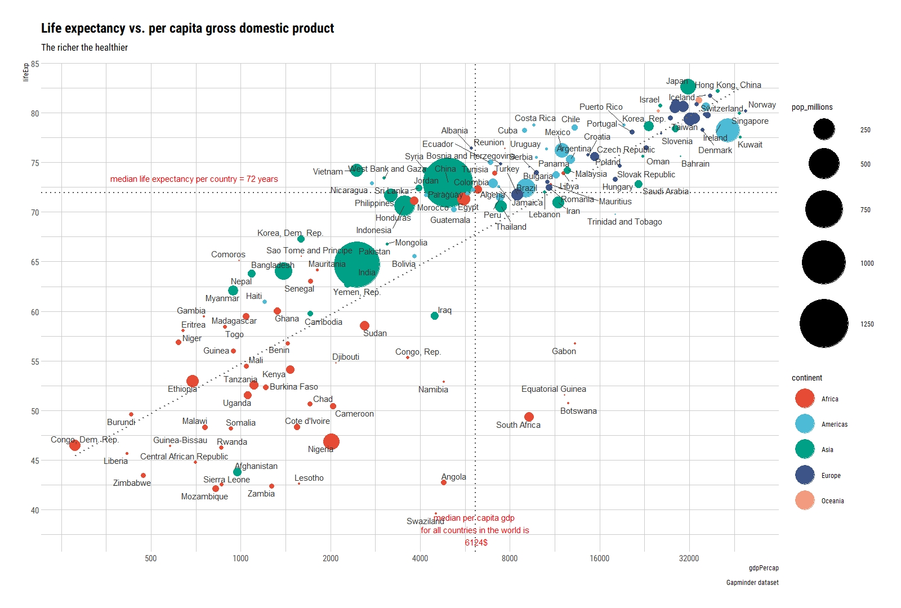

# Creating histogram plots in R

>We are going to create two types of histograms - first the histogram based on the number of times a record falls into each of the bins on which the histogram is based and the second which shows approximation of the probability density on the y axis together with the density kernel function. We are going to use approach based on different R libraries - `base` and `ggplot2` and learn how to annotate the plots. 
 
## Histograms with base R
Lets get familiar with the data. We will use `mtcars` - a dataset about different cars that is provided with R.

```{r}
# Lets get familiar with the data.
str(mtcars)
```

We will create histograms visualizing distribution of `mtcars$hp`(horsepower) and `mtcars$qsec` (1/4 mile time) that are deferentially distributed. We will create a 2 row 2 column grid to display 4 histograms - with count data and probability density approximation.

At first we need to create a grid layout for displaying 4 histograms at once - We set this up using `par()` function with appropriate values of `mfrow = c(rows,columns)` argument - we want 2 rows 2 column layout. 

```{r}
par(mfrow = c(2,2))

# first two histograms by row
# Filling Upper left
Hist_hp <- hist(mtcars$hp,
                main = "Histogram base R - counts", 
                ylab = "counts",
                xlab = "Horsepower")
# Flling upper right
Hist_hp_freq <- hist(mtcars$hp, 
                     main = "Histogram base R - density",
                     ylab = "probability density", 
                     xlab = "Horsepower",
                     freq = FALSE ,        #  to display probability density 
                                          #  instead of counts on the y axis
                     col = "lightgreen")

#ploting density kernel function on the second histogram 
lines(density(mtcars$hp),
      col = "red",
      lty = 2 ,   # type of line 2 for dashed
      lwd = 2 )    #  the width of line 

# bottom histograms
# filling bottom left 
Hist_qsec <- hist(mtcars$qsec,
                  ylab = "counts" ,
                  xlab = "1/4 mile time",
                  main = "")

# filling bottom right 
Hist_qsec_freq <- hist(mtcars$qsec, 
                       ylab = "probability density",
                       xlab = "1/4 mile time", 
                       main = "", 
                       freq = FALSE, 
                       col = "lightgreen")


```
 
 
```{r}
# Lets make the bins in both histograms of similar size

# How to do it ? - check the documentation with ?hist() in the console or help(hist)

# calculate mean and standard deviation and assign to variables
mean_horsepower <- mean(mtcars$hp)
sd_horsepower <- sd(mtcars$hp)

par(mfrow = c(2,2))

# The first histogram will have different number of bins characterized by breaks = argument
Hist_hp <- hist(mtcars$hp, 
                main = "Histogram base R - counts",
                ylab = "counts", 
                xlab = "Horsepower" , 
                breaks = 22, 
                col = "lightgreen")

Hist_hp_freq <- hist(mtcars$hp, 
                     main = "Histogram base R - density", 
                     ylab = "probability density", 
                     xlab = "Horsepower",
                     freq = FALSE)

lines(density(mtcars$hp), 
      col = "red" ,
      lty = 2 , 
      lwd = 2 )

# lets plot the normal distribution approximation for the mean and sd of horsepower
lines(50:350,
      dnorm(50:350, mean = mean_horsepower, sd = sd_horsepower),
      col = "green", 
      lwd = 2 )

# Ledend for the lines
legend("topright",
       legend=c("Empirical density", "Theoretical density"),
       col=c("red", "green"),
       lty=2:1,
       lwd = 2, 
       cex=0.8, 
       bg = "transparent" ,
       border = "transparent" ,
       bty = "n")

Hist_qsec <- hist(mtcars$qsec, 
                  ylab = "counts" ,
                  xlab = "1/4 mile time",
                  main = "")

Hist_qsec_freq <- hist(mtcars$qsec,
                       ylab = "probability density",
                       xlab = "1/4 mile time", 
                       main = "", 
                       freq = FALSE)

```


## Histograms with ggplot2

#### What is ggplot2?

`ggplot2` is a data visualization package and most popular package in R. Created by Hadley Wickham in 2005, ggplot2 is an implementation of Leland Wilkinson's Grammar of Graphics—a general scheme for data visualization which breaks up graphs into semantic components such as scales and layers. `ggplot2` can serve as a replacement for the `base` graphics in R and contains a number of defaults for web and print display for common plots.

In `ggplot2` plots are created as by  `ggplot() function` "feeded" with  `geom() functions` which are both made of aesthetics functions (`aes()`) and attributes `atribute =`. AEsthetics are based on input data while attributes are purely graphical. Let`s demonstrate how it works. The syntax is as follows:


  `Plot <- ggplot(dataframe, aes( x, y , ...) some_atribute = ...  )`+
    `geom_...(optional aditional data,  aes(x, y, ...), some_atribute =...)`
    
    
```{r}
# we do not need to use dollar mtcars$hp to extract column as a vector
# ggplot2 works also with only name of the columns in the dataframe 
library(ggplot2)

Hist_hp_ggplot2_1 <- ggplot(mtcars, aes(x = hp, y = stat(density)))+
  geom_histogram()

Hist_hp_ggplot2_1 


# Let`s make the plot similar to the one made with base R
Hist_hp_ggplot2_2 <- ggplot(mtcars, aes(x = hp))+
  geom_histogram(aes(fill= stat(count), y = stat(density)), 
                 binwidth = 50, 
                 center = 75)+
  scale_x_continuous(seq(50,350,50),
                     breaks = seq(50,350,50))
  
 
# gpplots are objects so we can add layers to a saved object. 
#Lets add density function

 Hist_hp_ggplot2_2 +
 geom_density(col = "red", 
              lty = "dashed", 
              size = 1)
 
# Lets add theoretical distribution function and make it little bit prettier  

Hist_hp_ggplot2_2 +
 geom_density(col = "red", 
              lty = "dashed",
              size = 1)+
  
  #ploting theoretical distribution
  
 stat_function(fun=dnorm,
               color="green",
               args=list(mean=mean(mtcars$hp), 
                         sd=sd(mtcars$hp)
                         )
               )+

  # white background
  theme_minimal()
```

### Creating your own functions - its getting hotter

We can create a reproducible function for creating such plots.
The basic syntax for creating a function is as follows: 

 `function_name <- function(obligatory_argument, obligatory_argument_2 ,  default argument = X ) {operation based on arguments}` 
 


```{r}
# Lets make a reproducible function for such a plot 

library(ggplot2)
draw_histogram_with_density_functions <- function(dataframe,
                                                  column,
                                                  binwidth,
                                              center = binwidth+1/2*binwidth)
  {
  Plot <-  ggplot(dataframe, aes(x = column))+
  geom_histogram(aes(fill= stat(count), y = stat(density)), 
                 binwidth = binwidth,
                 center = center)+
  scale_x_continuous(seq(binwidth,
                         max(column),
                         binwidth),
                     breaks = seq(binwidth,
                                 max(column),
                                 binwidth))+
  geom_density(col = "red", 
               lty = "dashed", 
               size = 1)+
  xlab("column")+
 
  #plotting theoretical distribution 
  stat_function(fun=dnorm,
                color="green",
                size = 1 ,
                args=list(mean=mean(column), 
                      sd=sd(column)))+
                
  # white background
  theme_minimal()
  return(Plot)
}

#lets test the function for other column of mtcars
draw_histogram_with_density_functions(mtcars,mtcars$qsec, 1)

# lets test it for other dataset 
draw_histogram_with_density_functions(airquality, airquality$Temp, 2)

```
 This is how we can store complicated codes as functions to be easily available in the future. If someone created such functions for us we may even not be interested what is happening under the hood - we are just satisfied with the final effect. R has enormous programming community and you can find libraries of functions performing great variety of operations. The libraries can be downloaded, among others, from main R repository - the [CRAN - Comprehensive R Archive Network](https://cran.r-project.org/web/views/); bionformatics repository - [Bioconductor project](https://www.bioconductor.org/) and individual programmers repositories availible at [Github](https://github.com/)


# Where to find inspiration and learn about good practices in visaualisation

With `ggplot2` it is possible to create whatever custom visualization you want. YOu can get inspired and learn about different types of charts and their proper usage on the following sites. [The R Graph gallery](https://www.r-graph-gallery.com/) provides example code for various commonly used chart types in R. On the [from Data to Viz site](https://www.data-to-viz.com/#story) you will find a proper option how to visualize your data and learn about common mistakes and good visualization practices. Some interesting tutorials and cheatsheats on ggplot2 are available at the [ggplot2tor](https://ggplot2tor.com/). Those are really  great resources. Do not be afraid - the ggplot2 graphic is based on layers - start with something simple and then add additional layers and play a little...

# Customisation of the scatter plot 

I will now present some options for customization of the famous scatter plot showing the relation of GDP per capita with the life expectancy. It is available in the `gapminder` library. 


```{r message=FALSE, warning=FALSE}
# loading,preparing and looking at the data for year 2007
library(gapminder)
library(tidyverse)
Gap2007 <- gapminder %>% filter(year == 2007) %>% mutate(pop_millions = pop/1000000)
glimpse(Gap2007)
#mean and median lifeExp
mean_lifeExp <- mean(Gap2007$lifeExp)
median_lifeExp <- median(Gap2007$lifeExp)
mean_lifeExp
median_lifeExp
median_income <- median(Gap2007$gdpPercap)
median_income

#calculate what part of world population lives in countries below 25th and 50th percentile

World_pop <-  sum(Gap2007$pop)


pop_below_50th_percentile <- Gap2007 %>%
                              filter(lifeExp < median_lifeExp,
                                    gdpPercap <median_income)%>%
                              summarize(poor_population = sum(pop)) %>%
                              unlist()
                                                        
pop_below_50th_percentile/World_pop
```

Let`s build a following plot step by step:
 
```{r echo=FALSE, fig.dim= c(16,9)}
library(knitr)


```
 
We will need the following additional libraries 
```{r}
library(hrbrthemes)  # themes with good looking fonts and design 
library(ggsci)       # color scales used by scientific journals
library(ggrepel)    # easy labeling of points in dense scatter plots
```

By adding subsequent layers of information to the saved basic plot object we will achieve the final appearance of plot above....

```{r}
#creating basic plot object
Gap_plot<-ggplot(Gap2007, aes(x= gdpPercap, y = lifeExp , color = continent))+
  geom_point(aes(size = pop_millions))

Gap_plot
```

As you can see out of the box the scale x is linear and sizes (area) of points do not correspond to real data. Let`s fix it.

```{r}
# Setting up maximum size for size scale for population
Gap_Plot2 <- Gap_plot+  scale_size_area(max_size = 28)+
#changing scale x to log10 and setting up breaks values to display on x axis  
  scale_x_log10(breaks = c(500, 1000, 2000, 4000,
                           8000, 16000, 32000, 64000))+
 
# setting up scale y breaks  
  scale_y_continuous(breaks = seq(35, 90, by = 5))

Gap_Plot2
```
As you can see the size_area() disrupted the proper proportions of legend and plot - we can fix it with modifying image display in chunk option

```{r, fig.dim= c(16,9)}
# This chunk is displayed with {r, fig.dim= c(16,9)}
Gap_Plot2

```


```{r,fig.dim= c(16,9)}
# adding vertical and horizontal lines for median   
Gap_Plot3 <- Gap_Plot2 + geom_hline(yintercept = median_lifeExp,
                                    lty = 3, 
                                    size = 0.8,
                                    color = "gray30")+
                         geom_vline(xintercept = median_income, 
                                    lty = 3, 
                                    size = 0.8, 
                                    color = "gray30")

Gap_Plot3
```


```{r,fig.dim= c(16,9)}
# adding annotation to median lines
Gap_Plot4 <- Gap_Plot3+
              annotate("text",
                       label = "median life expectancy per country = 72 years", 
                       x = 700,
                       y = median_lifeExp+1.5, 
                       size = 4, 
                       colour = "red")+
              annotate("text", 
                      label = "median per capita gdp \n for all countries in the world is \n 6124$",
                      x = median_income,
                      y = 38, 
                      size = 4,
                      colour = "red")

Gap_Plot4
```

```{r,fig.dim= c(16,9)}
#adding trendline 
  Gap_Plot5 <- Gap_Plot4+ geom_smooth(aes(group = 1),  
                                    # display grouped regression line
                                     method = "lm", #linear model
                                     se= FALSE,
                                      lty = 3, 
                                     lwd = 0.8 , 
                                     color = "gray40")

Gap_Plot5
```

```{r,fig.dim= c(16,9)}
Gap_Plot6 <- Gap_Plot5+ 
# adding title, subtitle and captions
  labs(title  = "Life expectancy vs. per capita gross domestic product",
       subtitle = "The richer the healthier",
       caption = "Gapminder dataset" )

Gap_Plot6
```


```{r,fig.dim= c(16,9)}
#adding text labels for countries
Gap_Plot7 <- Gap_Plot6 + geom_text_repel(aes(label = country), 
                                         color = "Gray20")

Gap_Plot7
```


```{r,fig.dim= c(16,11)}
Gap_Plot8 <- Gap_Plot7 +
  #adding custom theme and scale color
  theme_ipsum_rc()+
  scale_color_npg()+  # color scale from Nature Publishing Group
  
  # increasing the size of legend keys
guides(colour = guide_legend(override.aes = list(size=12)))

Gap_Plot8

```

> As you can see depsite the enourmous capabilities for customisation and the plenty of functions the "phiilosphy" of ggplot2 is relatively easy. Remember not to do a common mistake of not distinguishing properly beetwen aestetics aes() and graphical attributes...with understanding of the "layer approuch" you should be able to do your own plots with the help of stack overflow google and other forums...You do not have to remember all the functions attributes etc. - use the help of:

* [The R Graph gallery](https://www.r-graph-gallery.com/) which provides example code for various commonly used chart types 

* [Data to Viz](https://www.data-to-viz.com/#story) where you will find a proper option how to visualize your data and learn about common mistakes and good visualization practices.

* [ggplot2tor](https://ggplot2tor.com/) provides some useful cheatsheats
      
> do your own things, google example code, modify, play and you will gain hands on experience on one of the most powerful data visalisation tools...


